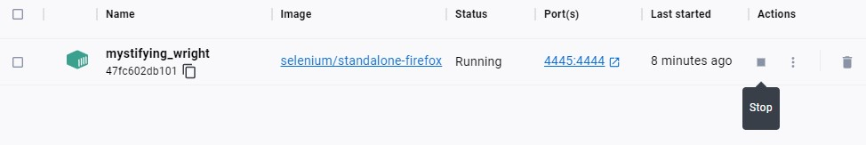
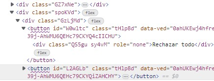
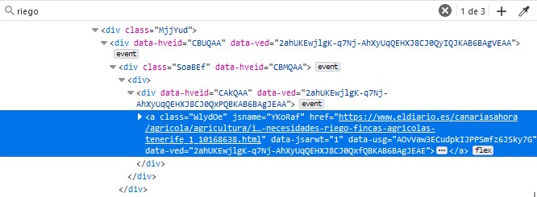
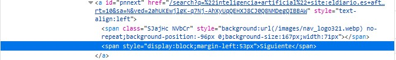
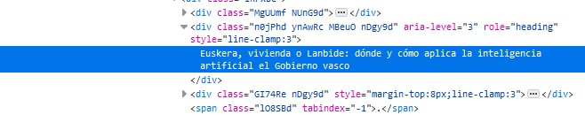
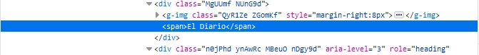
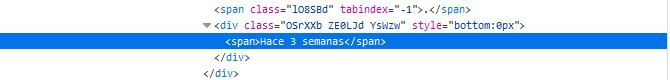
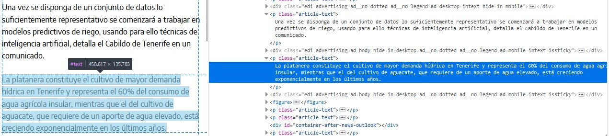

# 1. Introduction

For my master's thesis I have to extract the text and date of the news related 
to artificial intelligence published by two Spanish newspapers: [eldiario.es](https://www.eldiario.es/) and [El Mundo](https://www.elmundo.es/). 
In this rmd I explain how to perform the web scraping to extract this 
information from *eldiario.es* and *elmundo.es* and save it in a csv. 

# 2. Load libraries

First I am going to load the R libraries I will use:

```{r message=FALSE, warning=FALSE}
# General libraries:
library(tidyverse)

# Web scrapping libraries:
library(RSelenium)
library(xml2)
library(scrapex)
library(rvest)
library(httr)
```

```{r}
rm(list = ls()) # clean the environment
```


# 3. The original link: Google News

To extract the news from both digital newspapers I have decided to use Google's 
news search engine "Google News". This allows me to recycle the code and use a 
similar one for both newspapers. Otherwise, using the search engines of each 
digital newspaper I would have to create a specific code for each one, besides 
the search criteria would be different. 

The search query I have introduced in Google News to search for articles 
containing the words "artificial intelligence" in the webpage "eldiario.es" and
in the webpage "elmundo.es" are the following: 

- eldiario.es: "inteligencia artificial" site:eldiario.es after: 2023-04-03 
before: 2023-05-03
- elmundo.es: "inteligencia artificial" site:elmundo.es after: 2023-04-03 
before: 2023-05-03

The links of the webpage that I have to webscrap to, in turn, obtain the links 
of each news item are as follows:

- eldiario.es: "https://www.google.com/search?q=%22inteligencia+artificial%22+site:eldiario.es+after:2023-04-03+before:2023-05-03&lr=lang_es&tbs=lr:lang_1es&tbm=nws"

- elmundo.es: "https://www.google.com/search?q=%22inteligencia+artificial%22+site:elmundo.es+after:2023-04-03+before:2023-05-03&lr=lang_es&tbs=lr:lang_1es&tbm=nws"


# 4. Set user-agent

To identify the person who is scraping the website I have to set my user-agent. 
This string contains information about my computer/browser and my name/email to 
make identification easier. **If you are executing this code you have to save**
**here your own data (name / email address)**

```{r}
set_config(
  user_agent("Mozilla/5.0 (Windows NT 10.0; Win64; x64; rv:102.0) Gecko/20100101 Firefox/102.0; Isabel Molero / sisamolero@gmail.com")
)
```


# 5. Find the xpath for each article

Next I will look for the Xpath where each news item is located in the link. Keep 
in mind that on the Google News webpage the hyperlinks to each news item are 
spread over several pages. On each page there are 10 articles, and at the bottom 
you can click on a "next" button or directly click on the page number you want to
access.

Here I show a screenshot of how the news looks on the web:

```{r}

```

And in the case of the search for El Mundo articles:

```{r}

```

## Read the html

To find the xpath where each news item is located I will first save the link in 
an R object and read the html:

```{r}
# Create the objects with each link:

link_eldiario <- "https://www.google.com/search?q=%22inteligencia+artificial%22+site:eldiario.es+after:2023-04-03+before:2023-05-03&lr=lang_es&tbs=lr:lang_1es&tbm=nws"

link_elmundo <- "https://www.google.com/search?q=%22inteligencia+artificial%22+site:elmundo.es+after:2023-04-03+before:2023-05-03&lr=lang_es&tbs=lr:lang_1es&tbm=nws"
```

```{r}
# Read the html from the Google search "eldiario.es":

html_eldiario <- link_eldiario %>% 
  read_html()

html_eldiario

# Read the html from the Google search "elmundo.es":

html_elmundo <- link_elmundo %>% 
  read_html()

html_elmundo
```

Now in the web page itself I open the "developer tools" option and look for the 
tags in which the news are found in order to build the XPath.

```{r}
html_eldiario %>%
  xml_find_all("//a")

html_elmundo %>% 
  xml_find_all("//a")
```

Since I see that I can not access the XPaths without accepting cookies first, I am 
going to use RSelenium from here on out. I will explain how it works below.

# 6. RSelenium: open the Docker

Before starting the webscraping process into our computer environment the tool 
needed for this is a Docker. It is a container where we can run applications 
(in this case RStudio) and allows us to make more easy our work with a website 
(the Selenium browser is created into the docker container). It can be installed 
from here: Docker installation[https://www.docker.com/products/docker-desktop/]

Once the Docker is downloaded and installed in our computer, we have to open the 
control panel of our computer and execute the following lines:

- To pull the image: docker pull selenium/standalone-firefox

- To start the Docker container: docker run -d -p 4445:4444 selenium/standalone-firefox

Before executing the code in the rmd file **you need to ensure that the status of** 
**your Docker container is "running".**

```{r}

```

# 7. Inizialize the RSelenium Driver 

I have to prepare the environment to interact with a web browser programmatically. 
This involves specifying the browser type (e.g., Chrome, Firefox) and any additional settings required to establish the connection.

In my case I have written the specifications of my Docker container:

```{r}
remDr <- RSelenium::remoteDriver(remoteServerAddr = "localhost",
                                 port = 4445L,
                                 browserName = "firefox")
```

## Open the driver

Opening the driver in RSelenium refers to starting a session with the web browser 
specified in the RSelenium driver configuration. Once the driver is opened, I
can interact with the browser:

```{r}
remDr$open()
```

## Navigate to the link with RSelenium

The first thing I do is to navigate to the search link created above. As the 
first thing that appears is a warning about Cookies, I click on the accept button
with the XPath that I have previously located on the web (see image below).

After some steps I take screenshots to see that the remote browser is working 
properly. This can also be done through the Docker application on the computer. 
To do this, select the option to open it in the browser, and once there, in 
sessions, click on the camera icon to view the RSelenium process. 

I have also added *Sys.sleep()* which using RSelenium is necessary to pause the
execution of code for a specified duration. This is important because it gives 
webpages enough time to load completely, ensuring that elements are available 
for interaction. Additionally, it prevents overwhelming servers by introducing 
delays between requests.

```{r}
# navigate to the link with RSelenium
remDr$navigate(link_eldiario) 
remDr$screenshot(display = TRUE) 

Sys.sleep(2)

# Accept the cookies to be able to continue browsing the web
remDr$findElement(using = "xpath", value = "//button")$clickElement()
remDr$screenshot(display = TRUE)
```

```{r}

```

# 8. Read the html and find the elements

I search for a random word ("riego") from the title of one of the news items in 
the html developer tools of the page to see in which tags the links of each one
are inserted. Then I can create the XPath that takes me to each one of them. 

```{r}

```

```{r}
# Read the html and find the element where each notice is
page_source <- remDr$getPageSource()[[1]]
Sys.sleep(2)

html <- read_html(page_source)


# List with the links of each article
hrefs <- html %>% 
  xml_find_all("//a[@class = 'WlydOe']") %>% 
  xml_attr("href")

hrefs

# Here I have the links of the 10 nodes of the articles that appear in the first page of the Google search. 

```

## Find the XPath for the next page button and click on it

As I have done with the previous XPaths that I have needed, I search the webpage
for the tags in which the button that allows access to the next page is inserted:

```{r}

```

```{r}
html %>% 
  xml_find_all("//a[@id = 'pnnext']/span[2]")
```

```{r}
remDr$findElement(using = "xpath", value = "//a[@id = 'pnnext']/span[2]")$clickElement()
Sys.sleep(2)
remDr$screenshot(display = T)
```

It works!

# 9. Create a dataframe

Now I am going to create a dataframe with the title, the name of the newspaper,
the date of the article and the link of each article. 

## elDiario.es

### Find the XPath of the title

```{r}

```

```{r}
html %>% 
  xml_find_all("//div[@role ='heading' and @aria-level = '3']") %>% 
  xml_text()
```

### Find the XPath of the newspaper name

```{r}

```

```{r}
html %>% 
  xml_find_all("//div[@class = 'CEMjEf NUnG9d']/span") %>% 
  xml_text()
```

### Find the XPath of the date

```{r}

```

```{r}
html %>% 
  xml_find_all("//div[@style = 'bottom:0px']//span") %>% 
  xml_text()
```

Now that I have found all the XPaths, I need to extract this information for each
page in the Google Search and save it in a dataframe.

**I need to stop the Docker and then run it again:**

```{r}
remDr$open()
```

### Loop to create the dataframe

First I browse the link and accept the cookies:

```{r}
# Navigate:

remDr$navigate(link_eldiario)
Sys.sleep(2)
remDr$screenshot(display = T)

# Accept cookies:

remDr$findElement(using = "xpath", value = "//button")$clickElement()
Sys.sleep(2)
remDr$screenshot(display = TRUE)
```

Now I have to create a loop to extract the information for each page of the search:

```{r message=FALSE}

# Initialize an empty list to store data frames
df_list <- list()

# Initialize the flag variable
continue_loop <- TRUE

# Loop through the pages
while (continue_loop) {
  
  # Get the page source and read into html
  page_source <- remDr$getPageSource()[[1]]
  html <- read_html(page_source)
  
  # Scrape the data
  title <- html %>% 
    xml_find_all("//div[@role ='heading' and @aria-level = '3']") %>% 
    xml_text()
  
  newspaper <- html %>% 
    xml_find_all("//div[@class = 'CEMjEf NUnG9d']/span") %>% 
    xml_text()
  
  date <- html %>% 
    xml_find_all("//div[@style = 'bottom:0px']//span") %>% 
    xml_text()
  
  link <- html %>% 
  xml_find_all("//a[@class = 'WlydOe']") %>% 
  xml_attr("href")
    
  
  # Save the vectors in a data frame
  df <- data.frame(title, newspaper, date, link)
  
  # Add the data frame to the list
  df_list[[length(df_list) + 1]] <- df
  
  # Attempt to click the "next page" button
  tryCatch({
    remDr$findElement(using = "xpath", "//a[@id = 'pnnext']/span[2]")$clickElement()
  }, error = function(e) {
    continue_loop <<- FALSE  # Set the flag variable to exit the loop
  })
  
  remDr$screenshot(display = T)
  
  # Wait for the page to load
  Sys.sleep(3)
}

# Combine all data frames in the list into one
final_df <- do.call(rbind, df_list)
```

Now I use the *close()* function to close the Selenium WebDriver browser instance, which terminates the connection between RSelenium and the browser.

```{r}
remDr$close()
```

Let's see the dataframe:

```{r}
head(final_df %>% 
       select(newspaper, date, title, link))
```

## El Mundo

Now I have to repeat the same loop for the articles from El Mundo. To do this **I** 
**will first stop the Docker and then start it again:**

```{r}
remDr$open()
```

```{r}
# Navigate
remDr$navigate(link_elmundo)
Sys.sleep(2)

# Accept cookies
remDr$findElement(using = "xpath", value = "//button")$clickElement()
Sys.sleep(2)
```

Now I have to create a loop to extract the information for each page of the search:

```{r message=FALSE}

# Initialize an empty list to store data frames
df_list <- list()

# Initialize the flag variable
continue_loop <- TRUE

# Loop through the pages
while (continue_loop) {
  
  # Get the page source and read into html
  page_source <- remDr$getPageSource()[[1]]
  html <- read_html(page_source)
  
  # Scrape the data
  title <- html %>% 
    xml_find_all("//div[@role ='heading' and @aria-level = '3']") %>% 
    xml_text()
  
  newspaper <- html %>% 
    xml_find_all("//div[@class = 'CEMjEf NUnG9d']/span") %>% 
    xml_text()
  
  date <- html %>% 
    xml_find_all("//div[@style = 'bottom:0px']//span") %>% 
    xml_text()
  
  link <- html %>% 
  xml_find_all("//a[@class = 'WlydOe']") %>% 
  xml_attr("href")
    
  
  # Save the vectors in a data frame
  df <- data.frame(title, newspaper, date, link)
  
  # Add the data frame to the list
  df_list[[length(df_list) + 1]] <- df
  
  # Attempt to click the "next page" button
  tryCatch({
    remDr$findElement(using = "xpath", "//a[@id = 'pnnext']/span[2]")$clickElement()
  }, error = function(e) {
    continue_loop <<- FALSE  # Set the flag variable to exit the loop
  })
  
  # Wait for the page to load
  Sys.sleep(3)
}

# Combine all data frames in the list into one
final_df_em <- do.call(rbind, df_list)
```

Let's see the dataframe:
```{r}
head(final_df_em %>% 
       select(newspaper, date, title, link))
```

# 10. News from eldiario.es search engine

At this moment I realize that in the Google news search there is a limitation of 
30 pages displayed. That is, whatever date you put in the search will always 
appear at most 300 news. As I prefer to have more news for text analysis, I have 
decided to extract the news directly from the search engines of the two newspapers. 
Below is the code for the extraction of news from eldiario.es and later from El 
Mundo. To do this I have followed very similar steps to those shown above. 

```{r}
remDr$open()
```

```{r}
# Navigate:
link_eldiario2 <- "https://www.eldiario.es/busqueda/%22inteligencia%20artificial%22"
remDr$navigate(link_eldiario2)
Sys.sleep(2)

# Accept cookies:
remDr$findElement(using = "xpath", value = "//button[@id =
                    'didomi-notice-agree-button']")$clickElement()
Sys.sleep(2)

# Close the advertise:
remDr$findElement(using = "xpath", value = "//i[@class = 'close-icon-revista']")$clickElement()

Sys.sleep(2)
```

## Loop

First I create a loop to click on the next button and display all the news of 
the search. To do this I have to first scroll down to the bottom of the page and 
then, when the "next" button is displayed, click on it.

```{r}
number_clicks <- 100

for (i in 1:number_clicks) {
  
  webElem <- remDr$findElement("xpath", "//main")
  webElem$sendKeysToElement(list(key="end"))
  Sys.sleep(5)
  
  remDr$findElement(using = "xpath", "//button[@class='view-more-button blue-btn']")$clickElement()
  Sys.sleep(6)
  
  print(i)
}

```

## Save information in a dataframe

Once all the news are displayed, I read the html and save the three variables 
(headline, date and link) in a dataframe.

```{r}
page_source <- remDr$getPageSource()[[1]]
  Sys.sleep(2)
  
html <- read_html(page_source)

title <- html %>% 
    xml_find_all("//div[@class = 'second-column']/a") %>% 
    xml_text()
  
date <- html %>% 
    xml_find_all("//time") %>% 
    xml_text()
  
link <- html %>% 
  xml_find_all("//div[@class = 'second-column']/a") %>% 
  xml_attr("href")
  
# Save the vectors in a data frame
df2_eldiario <- data.frame(title, date, link)
```

## Save the dataframe in a csv file

Now I have a dataframe "eldiario_news2.csv" with the title, the date and the
link of each new. 

```{r}
write_csv(df2_eldiario, "../data/eldiario_news2.csv")
```

# 11. News from elmundo.es search engine

I am going to repeat the same process for the news from "El Mundo" digital
newspaper.

```{r}
remDr$open()
```

```{r}
# Navigate:
link_elmundo2 <- "https://ariadna.elmundo.es/buscador/archivo.html?q=inteligencia%20artificial&t=1&n=50&w=70&s=1"
remDr$navigate(link_elmundo2)
Sys.sleep(2)

# Accept cookies:
remDr$findElement(using = "xpath", value = "//button[@id =
                    'didomi-notice-agree-button']")$clickElement()
Sys.sleep(2)
```


```{r}
# Initialize an empty list to store data frames
df_list <- list()

# Initialize the flag variable
continue_loop <- TRUE

# Loop through the pages
while (continue_loop) {
  
  # Get the page source and read into html
  page_source <- remDr$getPageSource()[[1]]
  Sys.sleep(2)
  
  html <- read_html(page_source)
  
  # Scrape the data
  title <- html %>% 
    xml_find_all("//h3/a") %>% 
    xml_text()
  
  # date <- html %>% 
  #   xml_find_all("//span[@class = 'fecha']") %>% 
  #   xml_text()
  
  
  link <- html %>% 
    xml_find_all("//h3/a") %>% 
    xml_attr("href")
  
  
  # Save the vectors in a data frame
  df <- data.frame(title, link)
  
  # Add the data frame to the list
  df_list[[length(df_list) + 1]] <- df
  
  # Attempt to click the "next page" button
  tryCatch({
    remDr$findElement(using = "xpath", "(//div/ul[@class = 'nav nav_resultados']/li/a)[6]")$clickElement()
  }, error = function(e) {
    continue_loop <<- FALSE  # Set the flag variable to exit the loop
  })
  
  # Wait for the page to load
  Sys.sleep(3)
}

# Combine all data frames in the list into one
df2_elmundo <- do.call(rbind, df_list) 
```

Now I save the dataframe with the title and the link of each new ("elmundo_news2").

```{r}
write_csv(df2_elmundo, "../data/elmundo_news2.csv")
```

# 12. Dataframe with the content of the articles (elDiario.es)

Now that I have a dataframe with the date, title and link of each article I will 
create another loop to extract the text of the news item from each link. 

First I create a vector with the links of each article: 

```{r warning=FALSE, message=FALSE}
# Read both dataframes:
df2_eldiario <- read_csv("../data/eldiario_news2.csv") %>% 
  filter(!duplicated(link)) # I remove duplicated links. 

df2_elmundo <- read_csv("../data/elmundo_news2.csv") %>% 
  filter(!duplicated(link))

# Create the vector:
links <- df2_eldiario$link
```

```{r}
# Open RSelenium Driver
remDr$open()
```

Accept cookies:
```{r}
remDr$navigate(links[1])
remDr$findElement(using = "xpath", value = "//button[@id =
                    'didomi-notice-agree-button']")$clickElement()
```

## elDiario.es

Again I enter one of the articles in the digital newspaper and use the developer 
tools to find the XPath containing the text of the article. The image below shows 
this.

### Find the XPath of the article text

```{r}

```

### Loop to create the dataframe

Once I have found the XPath all I have to do is create the loop that reads the 
html of each link contained in the vector created above, extracts the text from 
the article and saves it in a dataframe along with the url. 

```{r}
# Initialize the dataframe with two columns:
eldiario_df <- data.frame(text = character(), link = character())  

for (link in links) {
  html <- read_html(link)
  
  text <- html %>% 
    xml_find_all("//p[@class = 'article-text']") %>% 
    xml_text()
  
  text <- paste(text, collapse = "")
  
  # Create a new dataframe with the text and link:
  article_df <- data.frame(text = text, link = link)
  
  # Append the new dataframe to eldiario_df
  eldiario_df <- rbind(eldiario_df, article_df)
  
  print(link)
}
```


## El Mundo

Now I have to repeat the same steps done previously but for the search of news 
from the website of the newspaper El Mundo (elmundo.es).

### Find the XPath of the text of the article

```{r}
link_prueba_elmundo <- "https://www.elmundo.es/tecnologia/2023/05/02/644ff85cfc6c83335d8b458e.html"
html_prueba_em <- read_html("https://www.elmundo.es/tecnologia/2023/05/02/644ff85cfc6c83335d8b458e.html")

text <- html_prueba_em %>% 
  xml_find_all("//div[@class = 'ue-l-article__body ue-c-article__body' and @data-section = 'articleBody']//p") %>% 
  xml_text() %>% 
  str_remove("Conforme a los criterios de") # I have to delete this last element because is not part of the article

text <- paste(text, collapse = "")

text
```

### Loop to create the dataframe

Before creating the loop I delete the duplicated news and correct some links 
that were misspelled as well as those with nas in the "link" variable. 

The loop will read the html for each link, extract the body of the news and the 
title and save it all together with the link. I have included in the loop two 
parts that are in charge of checking that the information has been extracted 
from the html and that, in case the link is broken, it continues with the next 
one and does not stop. 

```{r warning=FALSE}
df2_elmundo <- read_csv("../data/elmundo_news2.csv")

df2_elmundo <- df2_elmundo  %>% 
  filter(!duplicated(link)) %>% 
  filter(!duplicated(title)) %>% 
  mutate(link = str_replace(link, "//www.elmundo.es/economia/innovadores/2019/02/19/5c6ae9b721efa0fb378b46d4.html", 
                            "https://www.elmundo.es/economia/innovadores/2019/02/19/5c6ae9b721efa0fb378b46d4.html")) %>% 
  mutate(link = str_replace(link, "^//", "https://")) %>% 
  filter(!is.na(title))

links <- df2_elmundo$link
```


```{r}
library(rvest)
library(readr)

# Create an empty dataframe to store the data
elmundo_df <- data.frame(text = character(),
                         date = character(),
                         link = character(),
                         stringsAsFactors = FALSE)

# Iterate through each link
for (link in links) {
  Sys.sleep(1)
  print(link)
  tryCatch({
    # Read the HTML from the link
    html <- read_html(link)
    
    # Extract the text
    text <- html %>% 
      xml_find_all("//div[@class = 'ue-l-article__body ue-c-article__body' and @data-section = 'articleBody']//p") %>% 
      xml_text() %>% 
      str_remove("Conforme a los criterios de") 
    
    text <- paste(text, collapse = "")
    
    # Extract date2
    date <- html %>% 
      xml_find_all("//time") %>% 
      xml_attr("datetime")
    
    # Check if any data was extracted
    if (length(text) > 0 & length(date) > 0) {
      # Create a new row with the extracted information
      new_row <- data.frame(text = text,
                            date = date,
                            link = link,
                            stringsAsFactors = FALSE)
      
      # Append the new row to the result dataframe
      elmundo_df <- rbind(elmundo_df, new_row)
    }
  }, error = function(e) {
    # Handle HTTP error 404
    if (grepl("HTTP error 404", e$message)) {
      warning(paste("HTTP error 404 occurred for link:", link))
    } else {
      stop(e)
    }
  })
}

```

# 13. Save the dataframes in a csv file

```{r message=FALSE, warning=FALSE}
elmundo_df <- read_csv("../data/elmundo_text2.csv")
df2_elmundo <- read_csv("../data/elmundo_news2.csv")
```

# 14. Check for NAs in El Mundo news dataframe

I have realized that fore some rows in the dataframe there is no text. So I am going
to check what is happening. It looks like that for some old news the XPath for the 
article text is different, so I need to change the code to extract that text. 

```{r}
# Create new dataframe with the news with NAs in the "text" value
nas_elmundo_df <- elmundo_df %>% 
  filter(!duplicated(link)) %>% 
  filter(is.na(text))

# Create a vector with the links
links <- nas_elmundo_df$link
```

## Find the XPath

```{r}
link_prueba <- "https://www.elmundo.es/tecnologia/2018/08/20/5b7abcc4ca4741df698b45b8.html"

html <- read_html(link_prueba)

text <- html %>% 
      xml_find_all("//div[@itemprop='articleBody']//p") %>% 
      xml_text() %>% 
      str_remove("Conforme a los criterios de") 
    
text <- paste(text, collapse = "")
text
```

## Create a new loop to extract the text that is missing

```{r}

# Create an empty dataframe to store the data
elmundo_df_nas <- data.frame(text = character(),
                         date = character(),
                         link = character(),
                         stringsAsFactors = FALSE)

# Iterate through each link
for (link in links) {
  Sys.sleep(1)
  print(link)
  tryCatch({
    # Read the HTML from the link
    html <- read_html(link)
    
    # Extract the text
    text <- html %>% 
      xml_find_all("//div[@itemprop='articleBody']//p") %>% 
      xml_text() %>% 
      str_remove("Conforme a los criterios de") 
    
    text <- paste(text, collapse = "")
    
    # Extract date2
    date <- html %>% 
      xml_find_all("//time") %>% 
      xml_attr("datetime")
    
    # Check if any data was extracted
    if (length(text) > 0 & length(date) > 0) {
      # Create a new row with the extracted information
      new_row <- data.frame(text = text,
                            date = date,
                            link = link,
                            stringsAsFactors = FALSE)
      
      # Append the new row to the result dataframe
      elmundo_df_nas <- rbind(elmundo_df_nas, new_row)
    }
  }, error = function(e) {
    # Handle HTTP error 404
    if (grepl("HTTP error 404", e$message)) {
      warning(paste("HTTP error 404 occurred for link:", link))
    } else {
      stop(e)
    }
  })
}

```

```{r}
# Remove duplicated rows
elmundo_df_nas <- elmundo_df_nas %>% 
  filter(!duplicated(link))
```

```{r}
# save the dataframe
write_csv(elmundo_df_nas, "../data/elmundo_df_nas.csv")
```


